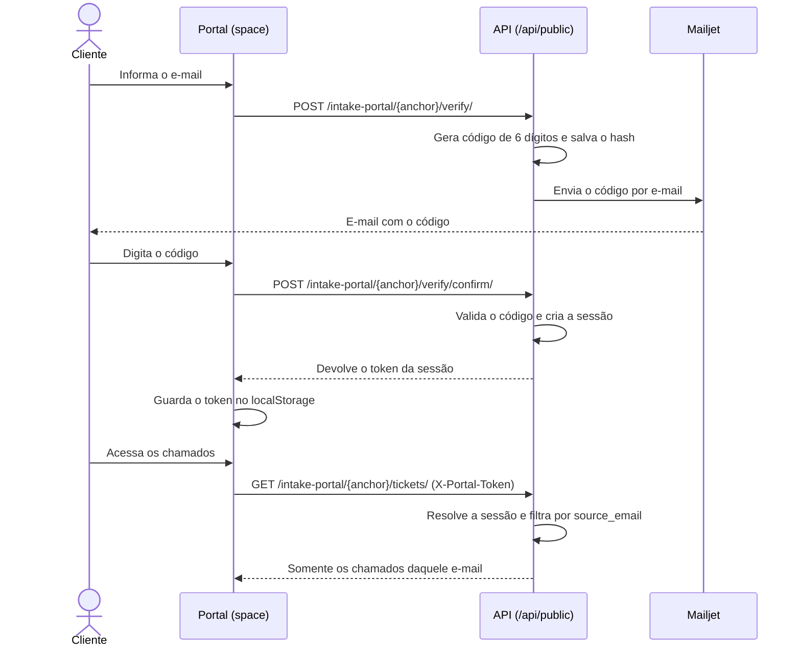

# Portal do cliente — fluxo de login

Documento de referência do fluxo de autenticação usado por quem abre chamados
pelo formulário público (`/spaces/intake/<anchor>`) e acompanha o andamento pelo
portal (`/spaces/portal/<anchor>`).

O portal **não usa contas do Plane**. O cliente externo não tem usuário, senha,
nem ocupa licença. A identidade dele é o próprio e-mail, comprovado por um
código de uso único.

## Visão geral



## Etapas

### 1. Solicitação do código

`POST /api/public/intake-portal/<anchor>/verify/`

```json
{ "email": "cliente@empresa.com" }
```

O que acontece no servidor:

1. O portal é resolvido pelo `anchor` **ou** pelo slug personalizado, e precisa
   estar habilitado. Portal desativado responde `404`.
2. O e-mail é normalizado (`strip` + minúsculas) e validado.
3. Se já houve um pedido para aquele e-mail há menos de **60 segundos**, a
   resposta é `429`.
4. Códigos anteriores ainda válidos do mesmo e-mail são marcados como usados.
5. Um código de **6 dígitos** é gerado com `secrets.randbelow` e gravado como
   **hash PBKDF2** (`make_password`). O código em texto puro nunca é persistido.
6. O envio ocorre em uma task Celery, então a resposta não espera o provedor.

A resposta é sempre genérica (`{"message": "Código enviado."}`), sem revelar se
o e-mail já abriu chamados antes.

### 2. Confirmação do código

`POST /api/public/intake-portal/<anchor>/verify/confirm/`

```json
{ "email": "cliente@empresa.com", "code": "123456" }
```

Validações aplicadas:

| Situação                      | Resultado                                     |
| ----------------------------- | --------------------------------------------- |
| Código inexistente ou expirado | `400` — solicitar novo código                 |
| Mais de **5 tentativas**       | `400` — o código é invalidado                 |
| Código incorreto               | `400` — contador de tentativas é incrementado |
| Código correto                 | `200` com o token da sessão                   |

O código expira em **10 minutos** e é de uso único: ao ser aceito, é marcado
como usado imediatamente.

Resposta de sucesso:

```json
{ "token": "<token opaco>", "email": "cliente@empresa.com" }
```

### 3. Sessão

O token é gerado com `secrets.token_urlsafe(48)` e devolvido **uma única vez**.
O banco guarda apenas o `SHA-256` do token — um vazamento da tabela não permite
reconstruir credenciais válidas.

- Validade: **7 dias**
- Escopo: vinculado ao workspace do portal
- Transporte: header `X-Portal-Token`
- Armazenamento no navegador: `localStorage`, na chave
  `plane-portal-session-<anchor>`

Cada portal guarda sua própria sessão, então o acesso a um formulário não
concede acesso a outro.

## Endpoints protegidos por sessão

| Método | Rota                                                     | Função                          |
| ------ | -------------------------------------------------------- | ------------------------------- |
| `POST` | `/api/public/intake-portal/<anchor>/work-items/`          | Abrir chamado                   |
| `GET`  | `/api/public/intake-portal/<anchor>/tickets/`             | Listar os chamados do e-mail    |
| `GET`  | `/api/public/intake-portal/<anchor>/tickets/<issue_id>/`  | Detalhe de um chamado           |

Regras de acesso:

- A abertura de chamado exige que o e-mail do formulário seja **exatamente** o
  e-mail da sessão. Divergência devolve `401`.
- Listagem e detalhe filtram por `source_email` da sessão. Trocar o `issue_id`
  na URL não expõe chamado de terceiros: a consulta simplesmente não encontra o
  registro e devolve `404`.
- Apenas comentários marcados como `EXTERNAL` são exibidos. Notas internas da
  equipe nunca chegam ao cliente.

## Telas

| Rota                                | Função                                        |
| ----------------------------------- | --------------------------------------------- |
| `/spaces/intake/<anchor>`           | Formulário público, com confirmação embutida  |
| `/spaces/intake/<anchor>/<etiqueta>`| Mesmo formulário, já classificado pela etiqueta |
| `/spaces/portal/<anchor>`           | Login do cliente e lista de chamados          |
| `/spaces/portal/<anchor>/<id>`      | Detalhe do chamado e histórico público        |

No formulário, a confirmação acontece sem sair da página: o cliente pede o
código, digita e o bloco vira um selo verde de "E-mail confirmado". Quem já
confirmou antes (sessão válida no navegador) não precisa repetir o processo.

## Parâmetros

Definidos em [`portal_auth.py`](../apps/api/plane/space/views/portal_auth.py):

| Constante                       | Valor           |
| ------------------------------- | --------------- |
| `CODE_TTL_MINUTES`              | `10`            |
| `CODE_MAX_ATTEMPTS`             | `5`             |
| `CODE_RESEND_COOLDOWN_SECONDS`  | `60`            |
| `SESSION_TTL_DAYS`              | `7`             |
| `PORTAL_TOKEN_HEADER`           | `X-Portal-Token`|

Os endpoints de código também usam o throttle `intake_portal`
(**10 requisições por minuto por IP**), configurado em
`REST_FRAMEWORK.DEFAULT_THROTTLE_RATES`.

## Modelos

| Modelo                      | Tabela                        | Guarda                                            |
| --------------------------- | ----------------------------- | ------------------------------------------------- |
| `IntakePortalVerification`  | `intake_portal_verifications` | e-mail, hash do código, expiração, tentativas     |
| `IntakePortalSession`       | `intake_portal_sessions`      | e-mail, hash do token, expiração, último uso      |

## Entrega dos e-mails

O envio usa [`mailjet.py`](../apps/api/plane/utils/mailjet.py), que prefere a API
do Mailjet e cai para o SMTP da instância quando as credenciais não estão
configuradas.

```
MAILJET_API_KEY
MAILJET_API_SECRET
MAILJET_FROM_EMAIL
MAILJET_FROM_NAME   # opcional, padrão "Suporte"
```

O `MAILJET_FROM_EMAIL` precisa estar validado no Mailjet, senão a API rejeita o
envio. Sem Mailjet e sem SMTP, nenhum código é entregue e o cliente fica
impedido de abrir chamado — vale testar logo após o deploy.

## Sessão expirada

Passados os 7 dias, os endpoints respondem `401`. O portal limpa o token
armazenado e volta para a tela de login, onde o cliente refaz a verificação com
o mesmo e-mail e reencontra todo o histórico — os chamados são vinculados ao
endereço, não à sessão.
